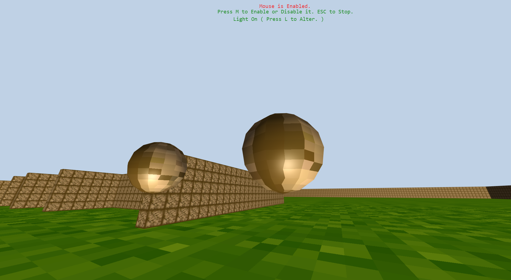

# WebGl-Three.JS-3D-Game-Development
Using JavaScript library Three.js , 3D game was developed by me.

three.js
========

[![NPM Package][npm]][npm-url]
[![Build Size][build-size]][build-size-url]
[![NPM Downloads][npm-downloads]][npmtrends-url]
[![Dev Dependencies][dev-dependencies]][dev-dependencies-url]
[![Language Grade][lgtm]][lgtm-url]

#### JavaScript 3D library ####

The aim of the project is to create an easy to use, lightweight, 3D library with a default WebGL renderer. The library also provides Canvas 2D, SVG and CSS3D renderers in the examples.

[Examples](http://threejs.org/examples/) &mdash;
[Documentation](http://threejs.org/docs/) &mdash;
[Wiki](https://github.com/mrdoob/three.js/wiki) &mdash;
[Migrating](https://github.com/mrdoob/three.js/wiki/Migration-Guide) &mdash;
[Questions](http://stackoverflow.com/questions/tagged/three.js) &mdash;
[Forum](https://discourse.threejs.org/) &mdash;
[Slack](https://join.slack.com/t/threejs/shared_invite/enQtMzYxMzczODM2OTgxLTQ1YmY4YTQxOTFjNDAzYmQ4NjU2YzRhNzliY2RiNDEyYjU2MjhhODgyYWQ5Y2MyZTU3MWNkOGVmOGRhOTQzYTk) &mdash;
[Discord](https://discordapp.com/invite/HF4UdyF)

### Usage ###

This code creates a scene, a camera, and a geometric cube, and it adds the cube to the scene. It then creates a `WebGL` renderer for the scene and camera, and it adds that viewport to the `document.body` element. Finally, it animates the cube within the scene for the camera.
